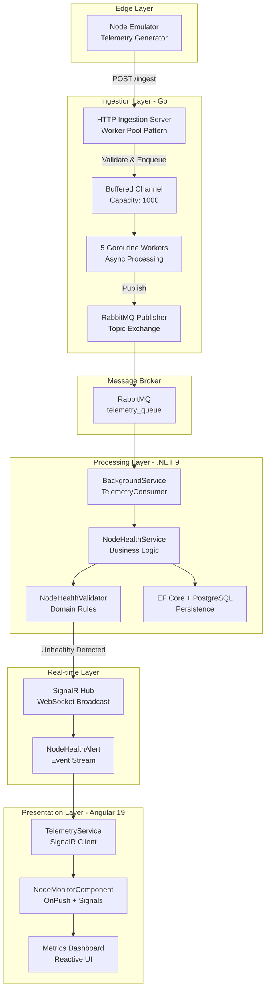

# Distributed Infrastructure & DePIN Telemetry Reference Architecture

A production-grade reference architecture demonstrating modern distributed systems patterns for monitoring DePIN (Decentralized Physical Infrastructure Networks) nodes in real-time. This system showcases high-throughput telemetry ingestion, event-driven processing, and reactive frontend monitoring with enterprise-grade patterns.

## Architecture Overview



## System Components

### 1. Telemetry Injector (Go)
- **Purpose**: High-throughput telemetry ingestion endpoint
- **Pattern**: Worker Pool with Goroutines and Buffered Channels
- **Key Features**:
  - 5 concurrent workers processing telemetry from a buffered channel (capacity: 1000)
  - Atomic operations for metrics tracking (`sync/atomic`)
  - RabbitMQ topic exchange with routing keys by device type
  - Automatic reconnection with exponential backoff
  - Field validation with immediate 202 Accepted response

### 2. Core Processor (.NET 9)
- **Purpose**: Business logic processing and persistence
- **Architecture**: Clean Architecture with Domain-Driven Design
- **Layers**:
  - **Domain**: Entities (Node, NodeTelemetry), Value Objects, Domain Services (NodeHealthValidator)
  - **Application**: Interfaces, DTOs, Application Services (NodeHealthService)
  - **Infrastructure**: EF Core DbContext, Repository implementations, BackgroundService
  - **API**: SignalR Hub, REST Controllers, Dependency Injection configuration
- **Key Features**:
  - BackgroundService for RabbitMQ consumption with fault tolerance
  - Entity Framework Core with PostgreSQL
  - SignalR integration for real-time broadcasts
  - Health validation with configurable thresholds (CPU 80%, Memory 85%, Disk 90%)
  - Consecutive unhealthy check tracking for alert escalation

### 3. Admin Dashboard (Angular 19)
- **Purpose**: Real-time monitoring dashboard
- **Pattern**: Standalone Components with OnPush Change Detection
- **Key Features**:
  - Angular Signals for reactive state management
  - SignalR client for real-time alert streaming
  - Tailwind CSS with Minimalist Dark theme
  - New control flow syntax (@for, @if)
  - Computed signals for dynamic metrics
  - Efficient rendering with ChangeDetectionStrategy.OnPush

## Engineering Trade-offs & Architecture Decisions

### Why Go for Ingestion Layer?

**Concurrency Model**: Go's Goroutines and Channels provide a lightweight concurrency model ideal for high-throughput ingestion. Each goroutine has a minimal memory footprint (~2KB stack), allowing us to spawn thousands of workers without significant overhead. The Worker Pool pattern with a buffered channel (capacity: 1000) provides backpressure handling, preventing system overload during traffic spikes.

**Atomic Operations**: Go's `sync/atomic` package enables lock-free metrics tracking, eliminating contention bottlenecks in the hot path. The `atomic.Int64` type ensures thread-safe counters without mutex overhead, critical for high-frequency telemetry scenarios.

**Simplicity & Performance**: Go's simplicity reduces cognitive load for concurrent programming. The language's built-in race detector and straightforward error handling make it ideal for infrastructure code where reliability is paramount. The compiled nature and efficient garbage collector provide predictable latency profiles.

**Trade-off**: Go lacks the rich ecosystem of .NET for complex business logic. This is intentional—we use Go for its strengths (concurrency, simplicity) and delegate business rules to .NET where DDD patterns shine.

### Why .NET 9 with Clean Architecture for Processing Layer?

**Clean Architecture Benefits**: The separation of concerns across Domain, Application, Infrastructure, and API layers enables independent testing, evolution, and maintenance. Domain entities remain pure of infrastructure concerns, while the Application layer orchestrates business logic without knowing about persistence details.

**BackgroundService Pattern**: .NET's `BackgroundService` provides a robust abstraction for long-running tasks with built-in cancellation token support, graceful shutdown, and DI integration. This is superior to manual thread management and ensures proper resource cleanup.

**Entity Framework Core**: EF Core's mature ORM capabilities with PostgreSQL provide type-safe database operations, migrations, and change tracking. The LINQ query syntax enables expressive, composable queries that are optimized at runtime.

**SignalR Integration**: SignalR offers automatic WebSocket fallback to Server-Sent Events and Long Polling, ensuring real-time connectivity across different network conditions. The strongly-typed Hub pattern with IHubContext injection enables clean separation between background processing and broadcast logic.

**Trade-off**: Clean Architecture introduces additional boilerplate and indirection. However, for a reference architecture demonstrating senior patterns, this complexity is justified by the testability, maintainability, and scalability benefits it provides.

### Why Angular 19 with OnPush and Signals for Presentation Layer?

**OnPush Change Detection**: By default, Angular checks every component on every event. OnPush restricts checks to when @Input references change or events originate from the component. This is critical for high-frequency updates (telemetry alerts) to prevent performance degradation.

**Angular Signals**: Signals provide a reactive primitive that enables fine-grained reactivity. Unlike traditional RxJS Observables, Signals are synchronous and have a simpler mental model for component state. Computed signals automatically track dependencies and recalculate only when inputs change, eliminating manual subscription management.

**Standalone Components**: Standalone components eliminate the need for NgModule declarations, reducing boilerplate and enabling tree-shaking. This aligns with modern Angular development patterns and improves build times.

**New Control Flow Syntax**: The @for and @if directives provide better performance and developer experience compared to *ngFor and *ngIf. They track identity automatically, reducing change detection overhead.

**Trade-off**: Angular has a steeper learning curve than simpler frameworks like Vue or React. However, its opinionated structure, TypeScript-first approach, and enterprise tooling make it ideal for large-scale applications where maintainability is critical.

## Quick Start

### Prerequisites
- Docker and Docker Compose
- .NET 9 SDK (for local development)
- Go 1.22+ (for local development)
- Node.js 20+ (for local development)

### Running with Docker Compose

The entire infrastructure can be spun up using the provided docker-compose.yml:

```bash
# Start all services
docker-compose up -d

# View logs
docker-compose logs -f

# Stop all services
docker-compose down
```

### Services Exposed

- **Telemetry Injector**: http://localhost:8080
  - POST /ingest - Submit telemetry data
  - GET /health - Health check
  - GET /metrics - Service metrics

- **Core Processor API**: http://localhost:5000
  - GET /api/nodes/unhealthy - List unhealthy nodes
  - GET /hubs/nodehealth - SignalR Hub endpoint

- **Admin Dashboard**: http://localhost:4200
  - Real-time monitoring dashboard

- **RabbitMQ Management**: http://localhost:15672
  - Username: guest
  - Password: guest

- **PostgreSQL**: localhost:5432
  - Database: depin_telemetry
  - Username: postgres
  - Password: postgres

## Local Development

### Telemetry Injector (Go)

```bash
cd telemetry-injector-go
go mod download
go run main.go
```

### Core Processor (.NET 9)

```bash
cd core-processor-net
dotnet restore
dotnet build
dotnet run --project src/DePinCore.API
```

### Admin Dashboard (Angular 19)

```bash
cd admin-dashboard-angular
npm install
npm start
```

## API Documentation

### Submit Telemetry

```bash
curl -X POST http://localhost:8080/ingest \
  -H "Content-Type: application/json" \
  -d '{
    "device_id": "node-001",
    "device_type": "validator",
    "location": "us-east-1",
    "cpu_usage": 85.5,
    "memory_usage": 78.2,
    "disk_usage": 65.0,
    "network_in": 1024000,
    "network_out": 512000,
    "metrics": {
      "block_height": 12345,
      "peers_connected": 42
    }
  }'
```

### Get Unhealthy Nodes

```bash
curl http://localhost:5000/api/nodes/unhealthy
```

## Health Validation Rules

The system automatically flags nodes as unhealthy based on the following thresholds:

- **CPU Usage**: > 80%
- **Memory Usage**: > 85%
- **Disk Usage**: > 90%
- **Telemetry Timeout**: > 5 minutes without data
- **Consecutive Unhealthy Checks**: ≥ 3 triggers alert escalation

## Performance Characteristics

- **Ingestion Throughput**: ~10,000 events/sec with 5 workers
- **Processing Latency**: < 100ms from ingestion to persistence
- **UI Refresh Rate**: Real-time via SignalR WebSockets
- **Database**: PostgreSQL with connection pooling and indexing

## Security Considerations

This reference architecture focuses on patterns and does not implement production security features. For production deployment, consider:

- Authentication/Authorization for API endpoints
- TLS/SSL for all communications
- RabbitMQ authentication and TLS
- PostgreSQL encryption at rest
- Rate limiting on ingestion endpoint
- Input validation and sanitization

## License

This is a reference architecture for educational and portfolio purposes.

## Contributing

This is a demonstration project. Feel free to fork and adapt for your own DePIN monitoring needs.
